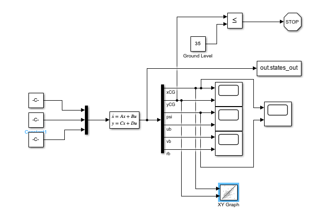
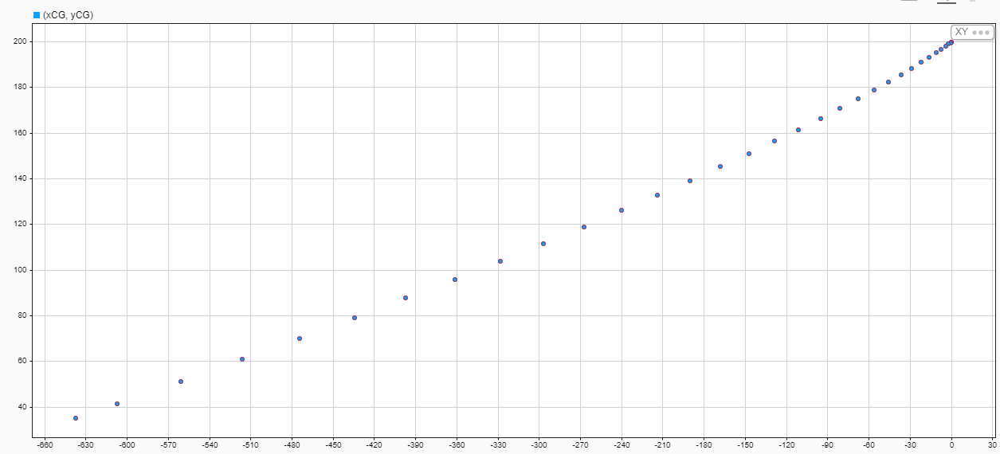
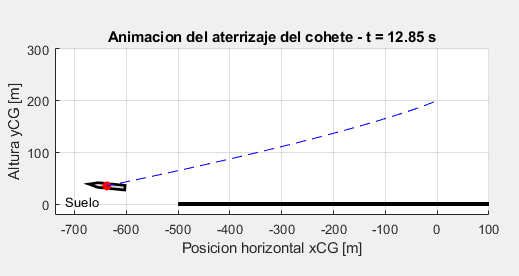

# Vertical Landing Modelling and Control Project

Bachelor's Thesis project focused on the modelling, simulation and analysis of a reusable rocket during the vertical landing phase.

The project is being developed in MATLAB and Simulink and aims to establish the dynamic model required for the later development of an autonomous landing control system.

## Current work

### 1. Dynamic modelling and open-loop simulation

A linearized state-space model of the rocket has been implemented using six state variables:

- Horizontal position
- Vertical position
- Pitch angle
- Longitudinal velocity
- Lateral velocity
- Angular velocity

The model considers thrust-vector deflection and thrust variation as system inputs.

Different operating conditions and disturbances are analysed, including:

- No thrust
- Thrust equal to vehicle weight
- Thrust above and below equilibrium
- Initial angular disturbances
- Lateral wind disturbances

The system is implemented in Simulink and its states and trajectory are analysed in open loop.

#### Simulink model

The rocket dynamics are implemented in Simulink using a state-space representation. The model includes the system inputs, six state variables, trajectory visualization and export of simulation results to MATLAB.

#### Open-loop behaviour

The open-loop simulations show how the system behaves under different operating conditions and disturbances. In the angular disturbance case, the rocket develops a significant lateral deviation because no feedback controller is present to correct its attitude or trajectory.

#### MATLAB visualization

Simulation results exported from Simulink are used in MATLAB to generate a simple visual representation of the rocket trajectory and attitude during the landing phase.

### 2. Discretization and structural analysis

The continuous-time model is discretized using a selected sampling time.

The current analysis includes:

- Discrete state-space matrices
- Continuous and discrete poles
- Stability analysis
- Controllability
- Observability
- Lateral and vertical subsystem analysis
- Sampling-time influence
- Parameter sensitivity

## Tools

- MATLAB
- Simulink
- State-space modelling
- Control Systems Toolbox

## Current status

Work in progress.

The current stages focus on modelling, simulation and system analysis. Future development will include the design and evaluation of closed-loop controllers for autonomous vertical landing.
